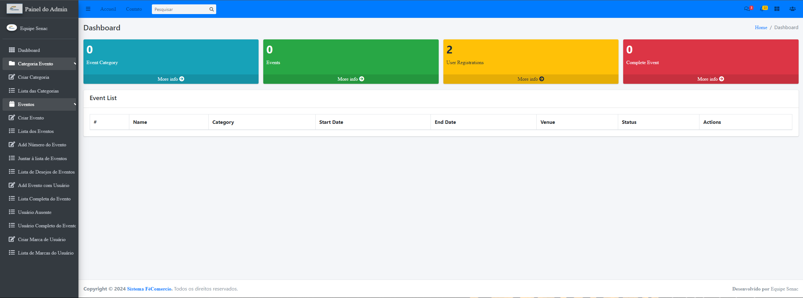

# FECOMERCIOO - Gerenciador de Eventos
Este é um sistema de gestão de eventos desenvolvido para atender às necessidades da FeComércio, garantindo conformidade com a LGPD (Lei Geral de Proteção de Dados) e facilitando o gerenciamento de inscrições e pagamentos. O sistema fornece uma interface intuitiva para organização de eventos, dashboards informativos e pagamentos seguros.

## Funcionalidades
Cadastro e gerenciamento de eventos.
Inscrições online com integração ao sistema de pagamentos.
Painéis administrativos com visualização de participantes e status dos pagamentos.
Área de administrador para gestão de usuários e configurações gerais.
Conformidade com a LGPD para proteção de dados dos usuários.

## Tecnologias Utilizadas
Backend: Python, Django
Banco de Dados: SQLite (padrão, pode ser configurado para outro SGBD)
Frontend: HTML, CSS, JavaScript
Gerenciamento de Pacotes: Pip
Versionamento: Git

## Pré-requisitos
Antes de começar, você precisará ter as seguintes ferramentas instaladas:

Python 3.9 ou superior
Git
Navegador web (para acessar o sistema)

## Como Rodar o Projeto

Clone o repositório:
git clone https://github.com/gufolena/FECOMERCIOO
Acesse o diretório do projeto:

cd FECOMERCIOO
Crie um ambiente virtual:

python -m venv env
Ative o ambiente virtual:

Linux/macOS:
source env/bin/activate

Windows:
env\Scripts\activate

Instale as dependências:
pip install -r requirements.txt

Configure o banco de dados:
python manage.py migrate

Crie um superusuário:
python manage.py createsuperuser

Execute o servidor:
python manage.py runserver
Acesse o sistema no navegador:

Página principal: http://127.0.0.1:8000/
Área de administrador: http://127.0.0.1:8000/admin

## Pré-visualização

## Contribuição
Contribuições são bem-vindas! Para contribuir:
Faça um fork do projeto.

## Licença
Este projeto está sob a licença MIT. Consulte o arquivo LICENSE para mais informações.
